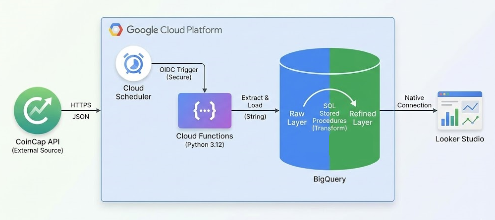
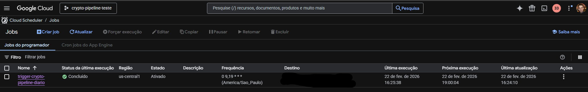
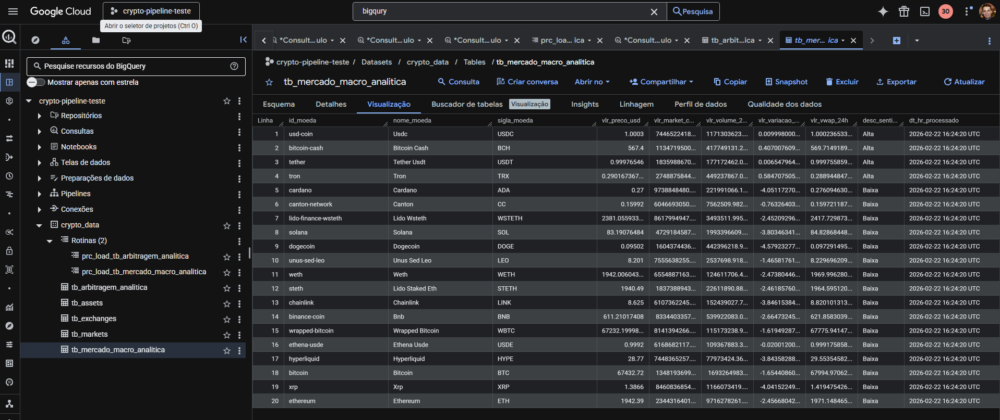
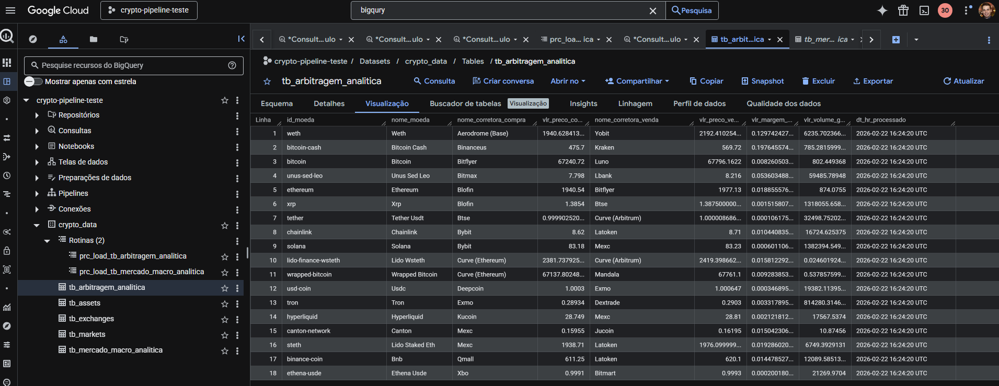
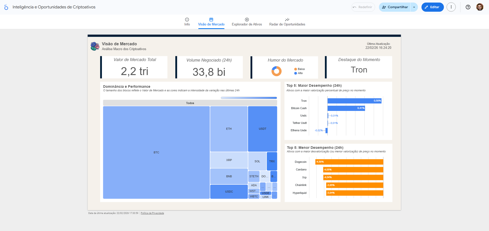

# 🚀 Crypto Data Pipeline (ELT) - Case Técnico 2

Este repositório contém a solução completa de **Extração de Dados via API**, implementando um pipeline moderno de engenharia de dados (ELT) 100% serverless no Google Cloud Platform (GCP).

O objetivo é extrair dados em tempo real da API pública da CoinCap, processar assincronamente e disponibilizar insights de arbitragem de criptomoedas em um dashboard analítico.


## 📋 Visão Geral da Arquitetura

A solução adota a arquitetura **ELT (Extract, Load, Transform)**. O processamento pesado foi delegado ao Data Warehouse, garantindo resiliência na extração e alta performance analítica.

  
  *Imagem gerada com IA

### 🛠️ Stack Tecnológica
* **Linguagem:** Python 3.12 (`pandas`, `requests`, `google-cloud-bigquery`)
* **Orquestração e Computação:** Cloud Functions (Gen 2 / Cloud Run) + Cloud Scheduler
* **Data Warehouse:** Google BigQuery
* **Visualização de Dados (BI):** Looker Studio
* **Infraestrutura / Segurança:** IAM (Service Accounts + Autenticação OIDC)

---

## 🏗️ Modelagem de Dados e Fluxo

O Data Warehouse foi segregado em duas camadas lógicas para garantir governança e performance:

### 1. Camada Raw (Ingestão)
* **Objetivo:** Armazenar o payload original de forma resiliente.
* **Tabelas:** `tb_assets`, `tb_markets`, `tb_exchanges`.
* **Engenharia:** Dados ingeridos estritamente como `STRING` para prevenir quebras contratuais (Schema Evolution) da API e particionados por data (`processado_em`).

### 2. Camada Refined (Analítica)
* **Objetivo:** Dados tipados, higienizados e modelados para o BI.
* **Tabelas:** 
    * `tb_arbitragem_analitica` (Focada em spread entre corretoras, otimizada com `CLUSTER BY id_moeda, nome_moeda, nome_corretora_compra, nome_corretora_venda`).
    * `tb_mercado_macro_analitica` (Visão global do mercado).
* **Engenharia:** Tabelas geradas via Stored Procedures dinâmicas. O fuso horário é ajustado nativamente para `America/Sao_Paulo` antes da disponibilização para o Looker Studio.

---

## 🛡️ DevSecOps e Boas Práticas

O pipeline não apenas extrai dados, mas aplica padrões corporativos de resiliência:

1. **Segurança Zero Trust:** A Cloud Function é privada. O gatilho público (`allUsers`) foi bloqueado. O pipeline é invocado exclusivamente pelo Cloud Scheduler utilizando um Token OIDC atrelado a uma Service Account com o princípio de Menor Privilégio (*Cloud Run Invoker*).
2. **Schema Enforcement Dinâmico:** O script Python utiliza `df.reindex()` para garantir que anomalias na API (colunas extras) sejam ignoradas, protegendo a integridade estrutural do BigQuery.
3. **Data Quality / Circuit Breakers:** As procedures em SQL possuem validações antes de truncar as tabelas analíticas. Se a origem não apresentar dados recentes (falha na API), a transação sofre `ROLLBACK`, impedindo que o dashboard exiba telas em branco.
4. **Princípio DRY:** Código Python modularizado com rotina genérica de ingestão (`run_elt_process`), centralizando logs sistêmicos (`logging`) e tratamento de exceções.

---

## 📸 Evidências de Execução

O pipeline está configurado em produção rodando autonomamente duas vezes ao dia (09:00 e 19:00 BRT).

<details>
  <summary><b>1. Execução Autenticada (Cloud Scheduler)</b></summary>
  <br>
  
</details>

<details>
  <summary><b>2. Camada Refined (BigQuery)</b></summary>
  <br>
  
  <br>
  
</details>

<details>
  <summary><b>3. Dataviz (Looker Studio)</b></summary>
  <br>
  
</details>

---

## 📂 Estrutura do Repositório

```text
crypto-pipeline-teste/
├── docs/               # Documentação, evidências visuais e arquitetura
│   └── img/            # Prints de execução censurados (Scheduler, BigQuery, Looker)
├── sql/
│   ├── ddl/            # Scripts de criação das tabelas (Raw e Refined)
│   └── procedures/     # Lógicas de negócio e qualidade de dados em PL/SQL
├── src/
│   ├── main.py         # Código fonte da Cloud Function (Motor ELT)
│   └── requirements.txt
└── README.md           # Documentação principal
```

---
Desenvolvido por **Matheus Furlanetto von Hoonholtz**.